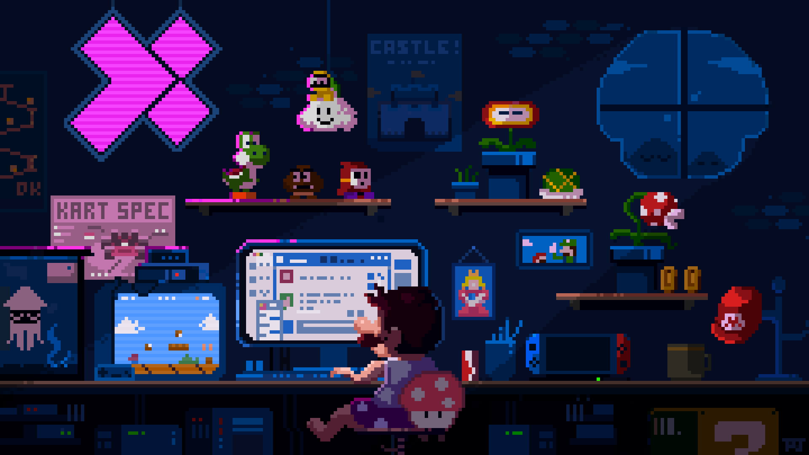

## 👋 Hey, I'm **Saish**

I love building new projects, It always starts by me trying to solve my own problem and then a full fledged project is made out of it with the best of my knowledge and technology i know

### Current Focus
- Building agentic AI systems with LangGraph, ReAct workflows & multi-agent orchestration
- Engineering advanced RAG pipelines — hybrid retrieval, RRF fusion, cross-encoder reranking & query expansion
- Working across the full ML/DL stack — Scikit-Learn, PyTorch, Transformers & Hugging Face
- Exploring GenAI, LLM finetuning & prompt engineering for real-world applications
- Shipping production AI systems with FastAPI, Docker & vector databases

*"Write code. Break code. Fix it. Repeat."*

## 🚀 Tech Stack

### 👨‍💻 Languages

### 🤖 AI & Machine Learning

### 🧠 GenAI & LLM Systems

### 🌐 Web Technologies

### 🗄️ Databases & Vector Stores

### 🛠️ DevOps & Tools

### 🎨 Creative Tools

⭐ If you like what you see, drop a star and let's build something together.

## 🐍 Contribution Snake

