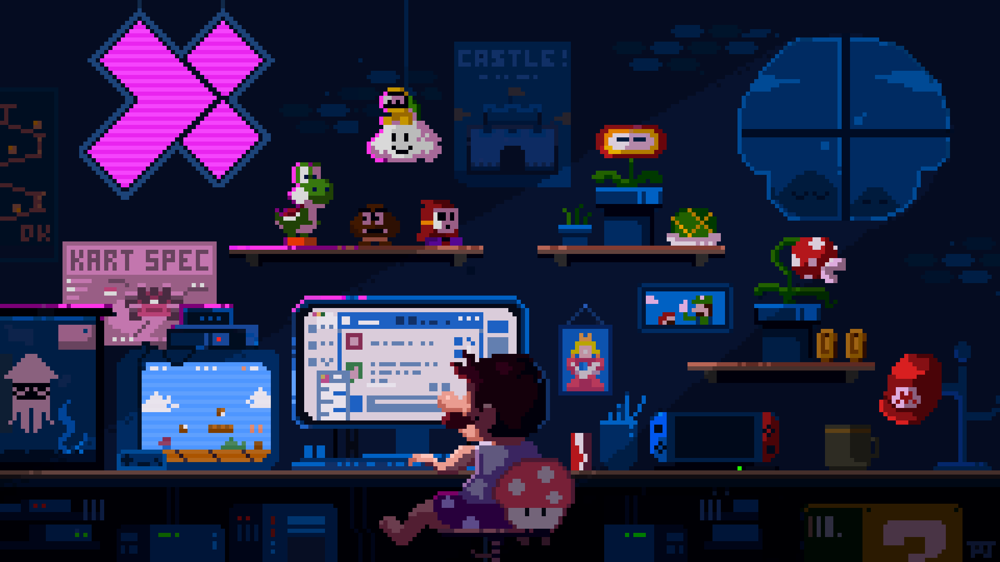

  

 

  

 

---

<!-- 01 / tech stack -->

  

`// AI & LLM Systems`

`// ML / DL`

`// Languages`

`// Databases & Vector Stores`

`// Web & Backend`

`// DevOps & Tools`

`// Creative`

---

<!-- 02 / github stats -->

  

---

<!-- 03 / contributions -->

  

---

*"Write code. Break code. Fix it. Repeat."*

⭐ if you like what you see, drop a star · let's build something

